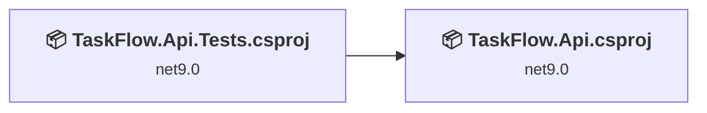
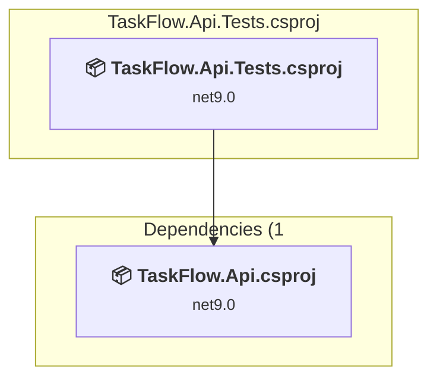
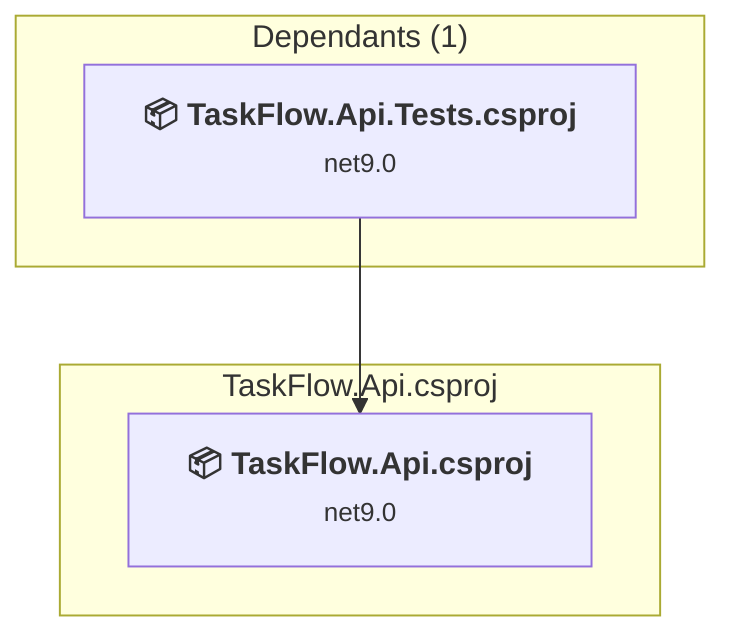

# Projects and dependencies analysis

This document provides a comprehensive overview of the projects and their dependencies in the context of upgrading to .NETCoreApp,Version=v10.0.

## Table of Contents

- [Executive Summary](#executive-Summary)
  - [Highlevel Metrics](#highlevel-metrics)
  - [Projects Compatibility](#projects-compatibility)
  - [Package Compatibility](#package-compatibility)
  - [API Compatibility](#api-compatibility)
- [Aggregate NuGet packages details](#aggregate-nuget-packages-details)
- [Top API Migration Challenges](#top-api-migration-challenges)
  - [Technologies and Features](#technologies-and-features)
  - [Most Frequent API Issues](#most-frequent-api-issues)
- [Projects Relationship Graph](#projects-relationship-graph)
- [Project Details](#project-details)

  - [TaskFlow.Api.Tests\TaskFlow.Api.Tests.csproj](#taskflowapiteststaskflowapitestscsproj)
  - [TaskFlow.Api\TaskFlow.Api.csproj](#taskflowapitaskflowapicsproj)

## Executive Summary

### Highlevel Metrics

| Metric | Count | Status |
| :--- | :---: | :--- |
| Total Projects | 2 | All require upgrade |
| Total NuGet Packages | 23 | 8 need upgrade |
| Total Code Files | 53 |  |
| Total Code Files with Incidents | 7 |  |
| Total Lines of Code | 4896 |  |
| Total Number of Issues | 35 |  |
| Estimated LOC to modify | 25+ | at least 0.5% of codebase |

### Projects Compatibility

| Project | Target Framework | Difficulty | Package Issues | API Issues | Est. LOC Impact | Description |
| :--- | :---: | :---: | :---: | :---: | :---: | :--- |
| [TaskFlow.Api.Tests\TaskFlow.Api.Tests.csproj](#taskflowapiteststaskflowapitestscsproj) | net9.0 | 🟢 Low | 2 | 22 | 22+ | DotNetCoreApp, Sdk Style = True |
| [TaskFlow.Api\TaskFlow.Api.csproj](#taskflowapitaskflowapicsproj) | net9.0 | 🟢 Low | 6 | 3 | 3+ | AspNetCore, Sdk Style = True |

### Package Compatibility

| Status | Count | Percentage |
| :--- | :---: | :---: |
| ✅ Compatible | 15 | 65.2% |
| ⚠️ Incompatible | 2 | 8.7% |
| 🔄 Upgrade Recommended | 6 | 26.1% |
| ***Total NuGet Packages*** | ***23*** | ***100%*** |

### API Compatibility

| Category | Count | Impact |
| :--- | :---: | :--- |
| 🔴 Binary Incompatible | 1 | High - Require code changes |
| 🟡 Source Incompatible | 23 | Medium - Needs re-compilation and potential conflicting API error fixing |
| 🔵 Behavioral change | 1 | Low - Behavioral changes that may require testing at runtime |
| ✅ Compatible | 6906 |  |
| ***Total APIs Analyzed*** | ***6931*** |  |

## Aggregate NuGet packages details

| Package | Current Version | Suggested Version | Projects | Description |
| :--- | :---: | :---: | :--- | :--- |
| Asp.Versioning.Mvc | 8.1.0 |  | [TaskFlow.Api.csproj](#taskflowapitaskflowapicsproj) | ✅Compatible |
| Asp.Versioning.Mvc.ApiExplorer | 8.1.0 |  | [TaskFlow.Api.csproj](#taskflowapitaskflowapicsproj) | ✅Compatible |
| coverlet.collector | 6.0.4 |  | [TaskFlow.Api.Tests.csproj](#taskflowapiteststaskflowapitestscsproj) | ✅Compatible |
| coverlet.msbuild | 6.0.4 |  | [TaskFlow.Api.Tests.csproj](#taskflowapiteststaskflowapitestscsproj) | ✅Compatible |
| FluentAssertions | 8.8.0 |  | [TaskFlow.Api.Tests.csproj](#taskflowapiteststaskflowapitestscsproj) | ✅Compatible |
| FluentValidation | 12.1.0 |  | [TaskFlow.Api.csproj](#taskflowapitaskflowapicsproj) | ✅Compatible |
| FluentValidation.DependencyInjectionExtensions | 12.1.0 |  | [TaskFlow.Api.csproj](#taskflowapitaskflowapicsproj) | ✅Compatible |
| Microsoft.ApplicationInsights.AspNetCore | 2.23.0 |  | [TaskFlow.Api.csproj](#taskflowapitaskflowapicsproj) | ✅Compatible |
| Microsoft.AspNetCore.OpenApi | 9.0.10 | 10.0.5 | [TaskFlow.Api.csproj](#taskflowapitaskflowapicsproj) | NuGet package upgrade is recommended |
| Microsoft.EntityFrameworkCore | 9.0.10 | 10.0.5 | [TaskFlow.Api.csproj](#taskflowapitaskflowapicsproj) | NuGet package upgrade is recommended |
| Microsoft.EntityFrameworkCore.InMemory | 9.0.10 | 10.0.5 | [TaskFlow.Api.Tests.csproj](#taskflowapiteststaskflowapitestscsproj) | NuGet package upgrade is recommended |
| Microsoft.EntityFrameworkCore.Sqlite | 9.0.10 | 10.0.5 | [TaskFlow.Api.csproj](#taskflowapitaskflowapicsproj) | NuGet package upgrade is recommended |
| Microsoft.EntityFrameworkCore.Tools | 9.0.10 | 10.0.5 | [TaskFlow.Api.csproj](#taskflowapitaskflowapicsproj) | NuGet package upgrade is recommended |
| Microsoft.Extensions.Diagnostics.HealthChecks.EntityFrameworkCore | 9.0.10 | 10.0.5 | [TaskFlow.Api.csproj](#taskflowapitaskflowapicsproj) | NuGet package upgrade is recommended |
| Microsoft.NET.Test.Sdk | 18.0.0 |  | [TaskFlow.Api.Tests.csproj](#taskflowapiteststaskflowapitestscsproj) | ✅Compatible |
| Microsoft.VisualStudio.Azure.Containers.Tools.Targets | 1.22.1 |  | [TaskFlow.Api.csproj](#taskflowapitaskflowapicsproj) | ⚠️NuGet package is incompatible |
| Moq | 4.20.72 |  | [TaskFlow.Api.Tests.csproj](#taskflowapiteststaskflowapitestscsproj) | ✅Compatible |
| NSubstitute | 5.3.0 |  | [TaskFlow.Api.Tests.csproj](#taskflowapiteststaskflowapitestscsproj) | ✅Compatible |
| Serilog.AspNetCore | 9.0.0 |  | [TaskFlow.Api.csproj](#taskflowapitaskflowapicsproj) | ✅Compatible |
| Serilog.Sinks.InMemory | 2.0.0 |  | [TaskFlow.Api.Tests.csproj](#taskflowapiteststaskflowapitestscsproj) | ✅Compatible |
| Swashbuckle.AspNetCore | 9.0.6 |  | [TaskFlow.Api.csproj](#taskflowapitaskflowapicsproj) | ✅Compatible |
| xunit | 2.9.3 |  | [TaskFlow.Api.Tests.csproj](#taskflowapiteststaskflowapitestscsproj) | ⚠️NuGet package is deprecated |
| xunit.runner.visualstudio | 3.1.5 |  | [TaskFlow.Api.Tests.csproj](#taskflowapiteststaskflowapitestscsproj) | ✅Compatible |

## Top API Migration Challenges

### Technologies and Features

| Technology | Issues | Percentage | Migration Path |
| :--- | :---: | :---: | :--- |

### Most Frequent API Issues

| API | Count | Percentage | Category |
| :--- | :---: | :---: | :--- |
| M:System.TimeSpan.FromMilliseconds(System.Int64,System.Int64) | 22 | 88.0% | Source Incompatible |
| M:System.Text.Json.JsonSerializer.Deserialize(System.String,System.Type,System.Text.Json.JsonSerializerOptions) | 1 | 4.0% | Behavioral Change |
| M:System.TimeSpan.FromSeconds(System.Int64) | 1 | 4.0% | Source Incompatible |
| M:Microsoft.Extensions.Configuration.ConfigurationBinder.GetValue''1(Microsoft.Extensions.Configuration.IConfiguration,System.String) | 1 | 4.0% | Binary Incompatible |

## Projects Relationship Graph

Legend:
📦 SDK-style project
⚙️ Classic project

## Project Details

### TaskFlow.Api.Tests\TaskFlow.Api.Tests.csproj

#### Project Info

- **Current Target Framework:** net9.0
- **Proposed Target Framework:** net10.0
- **SDK-style**: True
- **Project Kind:** DotNetCoreApp
- **Dependencies**: 1
- **Dependants**: 0
- **Number of Files**: 15
- **Number of Files with Incidents**: 3
- **Lines of Code**: 2941
- **Estimated LOC to modify**: 22+ (at least 0.7% of the project)

#### Dependency Graph

Legend:
📦 SDK-style project
⚙️ Classic project

### API Compatibility

| Category | Count | Impact |
| :--- | :---: | :--- |
| 🔴 Binary Incompatible | 0 | High - Require code changes |
| 🟡 Source Incompatible | 22 | Medium - Needs re-compilation and potential conflicting API error fixing |
| 🔵 Behavioral change | 0 | Low - Behavioral changes that may require testing at runtime |
| ✅ Compatible | 4691 |  |
| ***Total APIs Analyzed*** | ***4713*** |  |

### TaskFlow.Api\TaskFlow.Api.csproj

#### Project Info

- **Current Target Framework:** net9.0
- **Proposed Target Framework:** net10.0
- **SDK-style**: True
- **Project Kind:** AspNetCore
- **Dependencies**: 0
- **Dependants**: 1
- **Number of Files**: 42
- **Number of Files with Incidents**: 4
- **Lines of Code**: 1955
- **Estimated LOC to modify**: 3+ (at least 0.2% of the project)

#### Dependency Graph

Legend:
📦 SDK-style project
⚙️ Classic project

### API Compatibility

| Category | Count | Impact |
| :--- | :---: | :--- |
| 🔴 Binary Incompatible | 1 | High - Require code changes |
| 🟡 Source Incompatible | 1 | Medium - Needs re-compilation and potential conflicting API error fixing |
| 🔵 Behavioral change | 1 | Low - Behavioral changes that may require testing at runtime |
| ✅ Compatible | 2215 |  |
| ***Total APIs Analyzed*** | ***2218*** |  |

